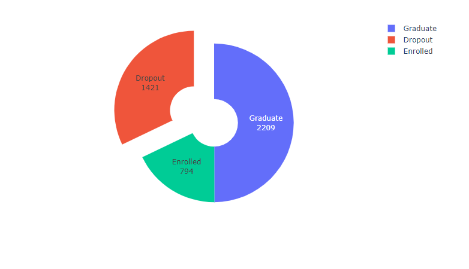
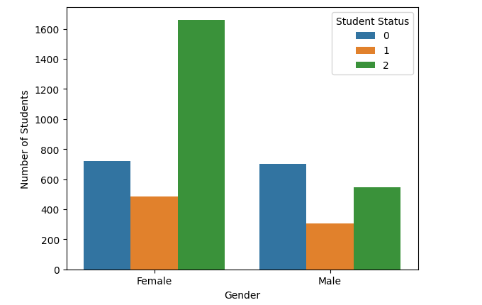

# Welcome to Predicting Student Dropout Repository

## About

_This is a Mini-Project for SC1015 (Introduction to Data Science and Artificial Intelligence) AY 23/24 Semester 2_

## Contributors

1. Denzel Elden Wijaya (@denzel-afk)
2. Federrico Hansen Budianto (@Jehantoro)
3. Reswara Anargya Dzakirullah (@reswaraa)

## Table of Contents

1. [Problem Introduction](#section-1)
2. [Exploratory Data Analysis (EDA) and Data Analysis](#section-2)
3. [Methodology](#section-3)
4. [Evaluation of the Predictions](#section-4)
5. [Conclusion, Implementation, and Insights](#section-5)
6. [References](#section-6)

## Problem Introduction

The universal right to quality education is acknowledged globally, prompting governments to prioritize the enrollment and successful completion of schooling for all children. Nevertheless, dropout rates appear as a significant obstacle, affected by various factors, such as diverse social, economic, and demographic factors. Recognizing this challenge, we need to make thorough analysis fixing this problem, even better in the early stages of undergraduate programs. This analysis aims to uncover the root causes and pinpoint at-risk populations, enabling the development of tailored strategies to effectively minimize dropout rates and strategizing a pre-program for undergraduate students , so they will be ensured that the education in the university is well-programmed.

In this notebook, utilizing “Predict Students’ Dropout and Academic Success. UCI Machine Learning Repository”, provided by Realinho, Valentim, Vieira Martins, Mónica, Machado, Jorge, and Baptista, Luís (2021) in UCI, we will present an in-depth analysis of student dropout in school education

#### Project Overview

The main goal of this project is to conduct a thorough examination of student dropout rates in school education, focusing particularly on undergraduate students, using the dataset "Predict Students' Dropout and Academic Success." Despite potential limitations such as the absence of school, area, or caste data, we aim to extract valuable insights from the dataset's existing attributes.

Our analysis aims to shed light on several key factors, that we will filter later:

1. **Demographic Analysis**: We will investigate how demographic factors like gender, age at enrollment, marital status, and nationality correlate with dropout rates.

2. **Economic Factors**: We will explore the impact of economic factors such as parental occupation, tuition fee payment status, and eligibility for scholarships on dropout rates. Furthermore, we also analyze some other indicators such as unemployment rate, inflation rate, and GDP growth and dropout rates, considering their indirect effects on education outcomes.

3. **Academic Performance**: We will analyze how students' academic performance, including curricular units and evaluations, influences their likelihood of dropping out.

4. **Social and Special Needs**: We will examine whether students with educational special needs or facing unique challenges like displacement or debt are more prone to dropping out.

The anticipated outcome is to provide valuable insights into the multifaceted factors affecting student dropout. By pinpointing high-risk groups and understanding the nuanced contributors to dropout rates, the school can design targeted interventions and policies to enhance student retention and cultivate an environment conducive to learning. Hence, here we are going to answer these 3 main questions:

#### Questions

1. Can we actually predict the chance of a particular undergraduate students being dropped out?
2. Is it true the myth that says parental background greatly influences a child's education?
3. Which of the model is the best fit for our prediction?

In subsequent sections of this notebook, we will delve into data preprocessing, exploratory data analysis, and the development of predictive models to aid in dropout analysis. Despite potential data limitations, we aim to contribute to the school’s efforts in safeguarding every student’s right to education and mitigating dropout rates wherever feasible.

## Exploratory Data Analysis and Data Visualization

There will be some sections to be shown to you

- **Data Visualization**
  Judging from the distribution of students `occupied`, `enrolled`, `dropped out` you will notice that the number of dropped out students is `1421` out of `4424`. This indicates the sector need a little seriousness on handling this case. These are also some distributions graphics based on some features

  `General Student Distribution`

  

  `Student Distribution - Gender`

  

  `Student Distribution - Age`

  

- **Correlation between Variables**
  We divide the correlations heatmap based on the big pictures of feature that we have divided above:

- **Data Preparation**
  Lastly in this section, we will filter a number of featrures that we are going to take out, since it has irrelevant correlations with the varaibel that we want to predict, which is the student status.

## Methodology

We will use various Machine Learning Techniques to determine which one is the best predictor, such as:

1. Logistic Regression
2. KNN (K-Nearest Neighbour)
3. Hyperparameter Tuning

## Evaluation of the Predictions

## Conclusion, Implementations, and Insights

## References

