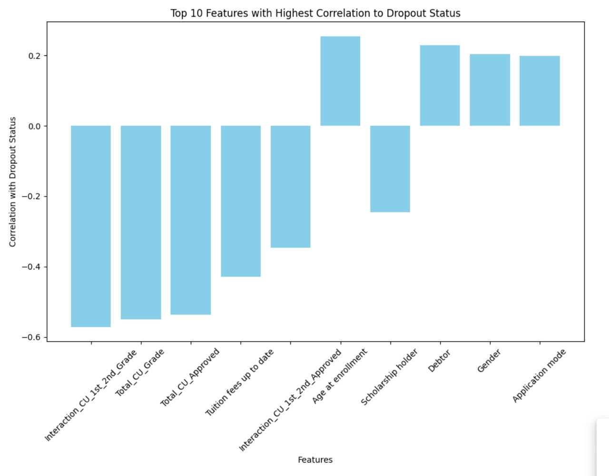

# Welcome to Predicting Student Dropout Repository

## About

_This is a Mini-Project for SC1015 (Introduction to Data Science and Artificial Intelligence) AY 23/24 Semester 2_

## Contributors

1. Denzel Elden Wijaya (@denzel-afk) - Machine Learning, Data Cleaning, and GitHub Setters
2. Federrico Hansen Budianto (@Jehantoro) - Presentation Slides, Evaluation, and Data Extraction
3. Reswara Anargya Dzakirullah (@reswaraa) - Data Visualization, Exploratory Data Analysis, and Data Extraction

## Table of Contents

1. [Problem Introduction](#section-1)
2. [Exploratory Data Analysis (EDA) and Data Analysis](#section-2)
3. [Methodology](#section-3)
4. [Evaluation of the Predictions and Conclusion](#section-4)
5. [Insights](#section-5)
6. [References](#section-6)

## Problem Introduction

This project aims to analyze more into student dropout rates in school education, particularly focusing on undergraduates, using the "Predict Students' Dropout and Academic Success" dataset from the UCI Machine Learning Repository. Despite potential limitations like missing school, area, or caste data, we aim to extract insights from existing attributes.

#### Key Analysis Area :

1. **Demographics**: Investigate correlations between gender, age at enrollment, marital status, nationality, and dropout rates.
2. **Economic Factors**: Explore the impact of parental occupation, tuition fee payment status, scholarships, and economic indicators like unemployment, inflation, and GDP growth on dropout rates.
3. **Academic Performance**: Analyze how academic performance influences dropout likelihood, considering curricular units and evaluations.
4. **Social and Special Needs**: Examine if students with special educational needs or facing challenges like displacement or debt are more prone to dropping out.

#### Questions and Objectives

1. Can we actually predict the chance of a particular undergraduate students being dropped out?
2. Is it true the myth that says parental background greatly influences a child's education?
3. Which of the model is the best fit for our prediction?

## Exploratory Data Analysis and Data Visualization

Here is one of the data visualizations that show you the top 10 features that influence student dropout status (after cleaning). For further analysis, you may open the NoteBook to find out some interesting features.

## Methodology (Models)

We will use various Machine Learning Techniques to determine which one is the best predictor, such as:

1. Random Forest
2. Logistic Regression (**Best One**)
3. SVM (Support Vector Machine)
4. KNN (K-Nearest Neighbour)

In advanced, we are going to combine those models into an ensemble one to gain the robustness of the model. Besides, we also apply the ROC, and t-SNE to hinder the models from overfitting and to check the accuracy of the models.

## Evaluation and Conlusion

- Academic performance is the highest correlated sectors with `Dropout Status`, where `Interaction_CU_1st_2nd_Grade` is the highest one ($0.57$)
- Combining **enrolled** and **graduate** into **Non Dropped** to make the model more accurate
- Although not the primary factor, parental background can indeed influence students' performance.
- SVM is the model that requires the most time to find the optimal model, taking 1 minute and 7 seconds.
- KNN ($0.8659$) gets the highest accuracy on the training sets and only takes 5 seconds to find the best models.
- Logistic Regression achieves the highest accuracy on the testing sets, with a score of $0.8514$, making it the best predictor.
- It is possible to predict the `Dropout Status` utiling the model that we have provided. Even if your data is unstructured, you can use the `Ensembled Model` that has been checked by ROC and t-SNE, which comprises the best feature in each model.

## Insights and Lessons

- Extraction from UCI Machine Learning Repository
- Data Cleaning with careful considerations
- PCA for dimension reduction.
- Logistic regression, SVM, KNN, and Random Forest
- Voting Classifier for Ensemble Model
- ROC and t-SNE for model evaluation
- FPR and TPR for ROC
- Working in Kaggle and Collaborating in GitHub

## References

- https://doi.org/10.24432/C5MC89.
- https://www.datacamp.com/tutorial/principal-component-analysis-in-python
- https://builtin.com/data-science/tsne-python
- https://scikit-learn.org/stable/auto_examples/model_selection/plot_roc.html
- https://machinelearningmastery.com/hyperparameters-for-classification-machine-learning-algorithms/
- https://pyimagesearch.com/2021/05/17/introduction-to-hyperparameter-tuning-with-scikit-learn-and-python/
